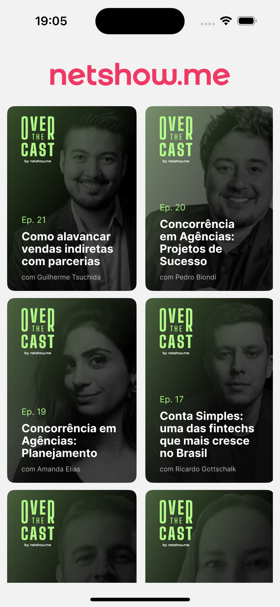

# Netshow.me




## Descrição do App

Este aplicativo é uma solução que permite assistir vídeos em React Native com navegação entre telas, reprodução via HLS, API dinâmica com json-server, skeletons e animações para aprimorar a UX.

## Tecnologias Usadas

O projeto foi desenvolvido utilizando as seguintes tecnologias e bibliotecas:

- **React**: Biblioteca JavaScript para construir interfaces de usuário.
- **React Native**: Framework para construir aplicações móveis.
- **Expo**: Ferramenta para desenvolvimento rápido de aplicativos React Native.
- **React Navigation**: Biblioteca para navegação em aplicativos React Native.
- **React Query**: Ferramenta para gerenciamento de estado e cache de dados assíncronos.
- **Axios**: Cliente HTTP baseado em Promises para o navegador e Node.js.
- **JSON Server**: Para simular uma API REST.
- **Outras Dependências**:
  - `react-native-safe-area-context`
  - `react-native-screens`
  - `react-native-svg`
  - `expo-av`
  - `rn-placeholder`

### Dependências de Desenvolvimento

- **TypeScript**: Superset do JavaScript que adiciona tipos estáticos.
- **ESLint**: Ferramenta de linting para identificar e corrigir problemas em código JavaScript e TypeScript.
- **Configurações ESLint da Rocketseat**: Conjunto de regras para manter a qualidade do código.

## Como rodar o projeto

Siga os passos abaixo para rodar o projeto na sua máquina:

```bash
git clone https://github.com/GersonRocha9/teste-netshow.me.git

cd teste-netshow.me

npm install

npm run server

npx expo start
```
